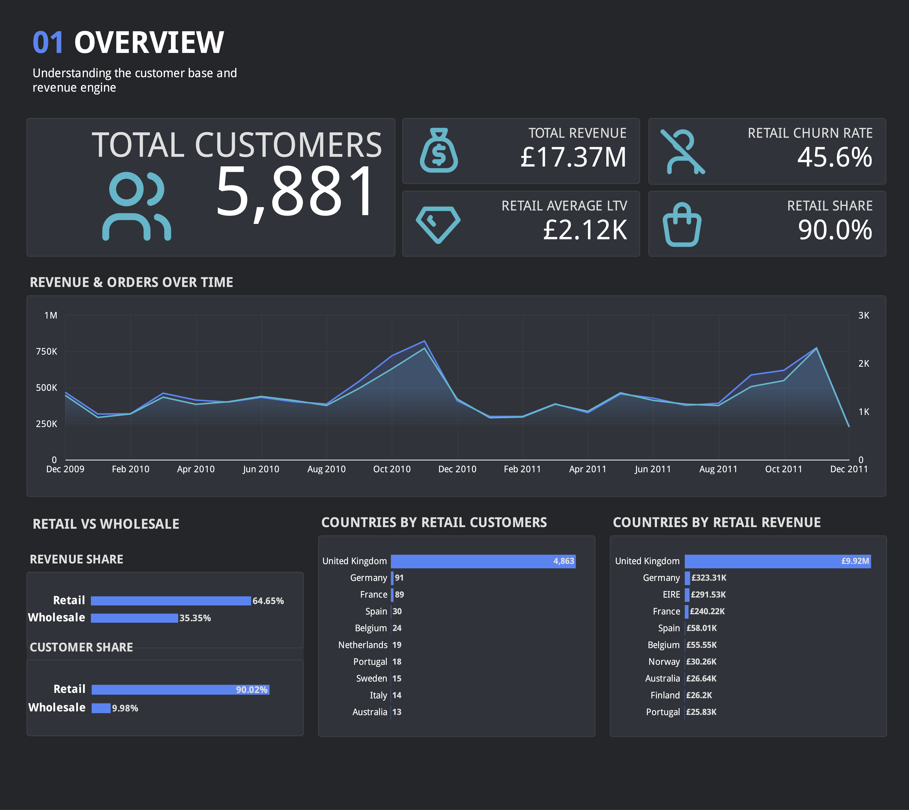
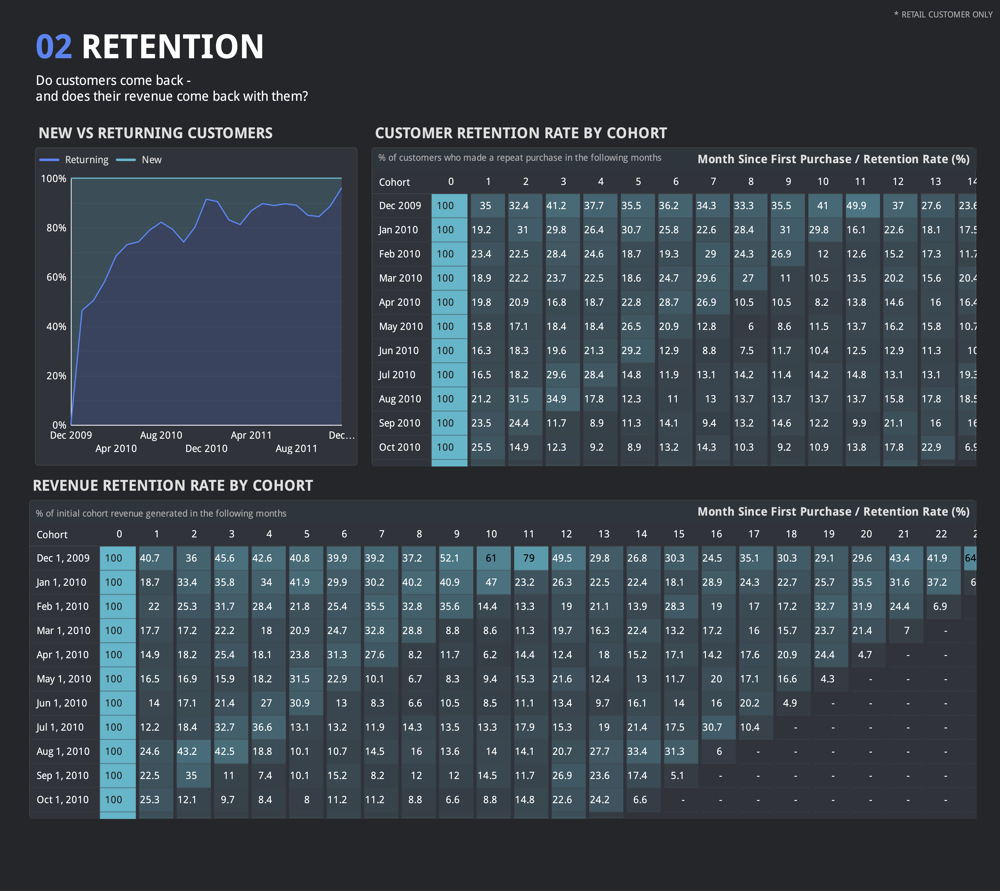
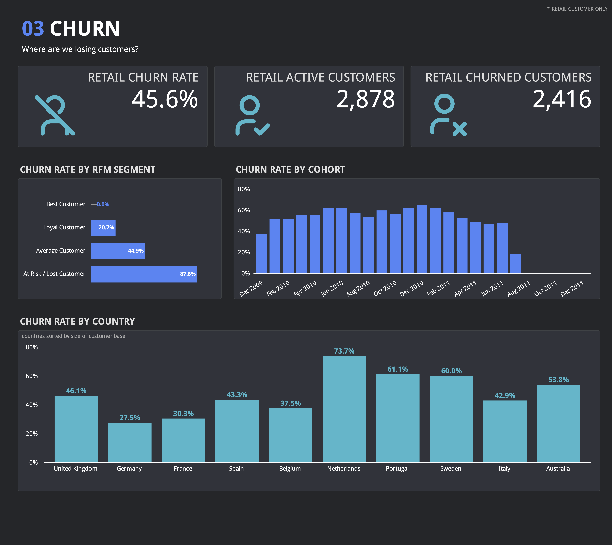
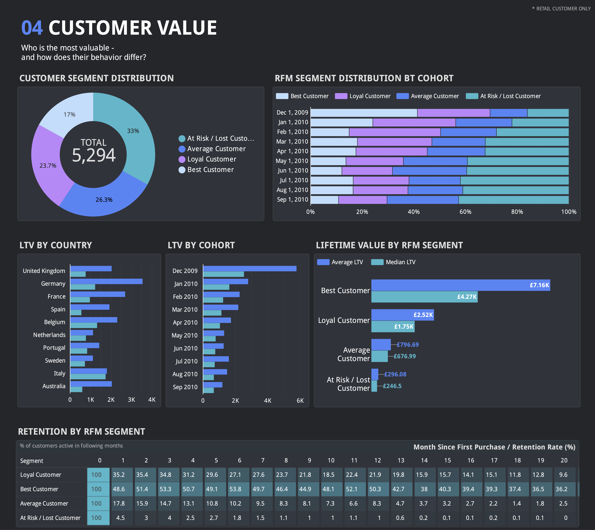

# Customer Lifecycle & Retention Analytics

Cohort, churn, LTV and RFM analysis of a UK-based online retailer, built on the [Online Retail II dataset](https://www.kaggle.com/datasets/mashlyn/online-retail-ii-uci). Python-based exploratory analysis in Google Colab feeds a 4-page Looker dashboard covering the full customer lifecycle.

## 🔗 Live dashboard

[Looker Dashboard](https://datastudio.google.com/reporting/8d32e1ac-5498-4e54-9b98-2bd6c482cf89)

### 📊 Dashboard Preview






## 📓 Google Colab Notebook

[Customer Lifecycle & RFM Analysis](https://colab.research.google.com/drive/16nWIonVYARFfpDuga0TQm6VsLzvjMeCb?usp=sharing)

---

## 📌 Project goals

Customer analytics workflow for an e-commerce business: clean and segment a messy transactional dataset, then answer core lifecycle questions:

- How much of the business is Retail vs Wholesale, and does that distinction matter?
- Do customers come back and does their revenue come back with them?
- Where and when are we losing customers and is churn evenly distributed?
- Who are our most valuable customers and how much is a typical customer worth over time?

---

## 🗂️ Repository structure

```
├── data/
│   ├── cohort_retention.csv
│   ├── cohort_revenue.csv
│   ├── customer_master.csv
│   ├── monthly_sales.csv
│   ├── new_returning_monthly.csv
│   └── retention_by_segment.csv
│
├── notebooks/
│   └── customer_lifecycle_analysis.ipynb
│
├── screenshots/
│   ├── 01_overview.png
│   ├── 02_retention.png
│   ├── 03_churn.png
│   └── 04_customer-value.png
│
└── README.md
```

---

## 🧱 Data Architecture

```
Kaggle CSV (Online Retail II)
      │
      ▼
Google Colab
      │
      ├── Data cleaning (missing IDs, cancellations, negative qty/price, duplicates)
      ├── Retail vs Wholesale segmentation (behavior-based, IQR threshold)
      ├── Cohort / retention / churn / LTV / RFM analysis
      │
      ▼
Aggregated tables to CSV
      │
      ▼
    Looker
```

---

## 🛠️ Tech stack

- **Python** (pandas, numpy, matplotlib, seaborn) - Google Colab
- **Looker Studio** — dashboard and data visualization

---

## 📊 Dashboard pages

| Page | Key content |
|---|---|
| Overview | Total customers, Total revenue, Retail churn rate, Retail Avg LTV, Retail share, Revenue & Orders trend, Retail vs Wholesale, Top countries by Revenue & Customers |
| Retention | New vs returning customers trend, Customer retention by cohort, Revenue retention by cohort |
| Churn | Retail churn rate, Retail active customers, Retail churned customers, Churn rate by RFM segment, Churn rate by cohort, Churn rate by country |
| Customer Value | RFM segment distribution, RFM segment by cohort, LTV by country, LTV by cohort, LTV by RFM segment, Retention by RFM segment |

---

## 🔍 Key insights

- The customer base is divided into two distinct behavioral groups. Wholesale customers account for about 10% of the total customer base but generate about 35% of revenue, and their median order value is approximately 2.5 times higher than that of retail customers. These two segments are analyzed separately.

- The RFM segment is a reliable indicator of both customer retention and churn. Retention rate for 'Best Customers' remains at 40-50% for many months, and the churn rate within the 138 day threshold is 0%, compared to customers in the 'At Risk / Lost' category, the retention rate approaches 0%, and the churn rate is approximately 88%.

- Customer retention declines sharply after the first purchase, with the largest drop occurring during the first few months.

- Customer lifetime value varies substantially across RFM segments. 'Best Customers' have an average LTV of approximately £7.2K compared with approximately £296 for 'At Risk / Lost Customers', highlighting the significant financial value of retaining high-value customers.

---

## ⚠️ Known limitations

- **Right-censoring**: Customers acquired later in the dataset have had less time to make repeat purchases, so their observed retention and LTV may be lower simply because they have been observed for a shorter period.
- **Retail/Wholesale split is behavior-based, not a ground-truth label**: the IQR-derived threshold identifies a distinct high-volume group, but the scatter plot shows some overlap between segments - not a perfectly clean split.
- The final month (December 2011) is **incomplete**.
